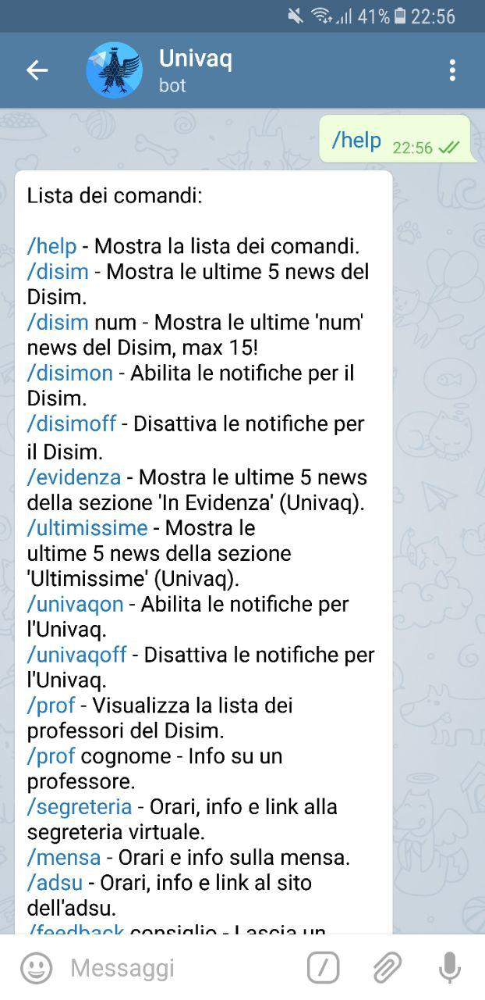
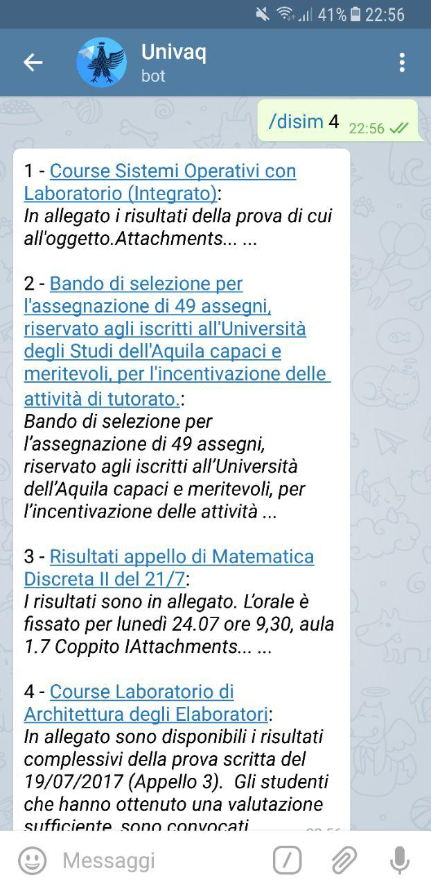
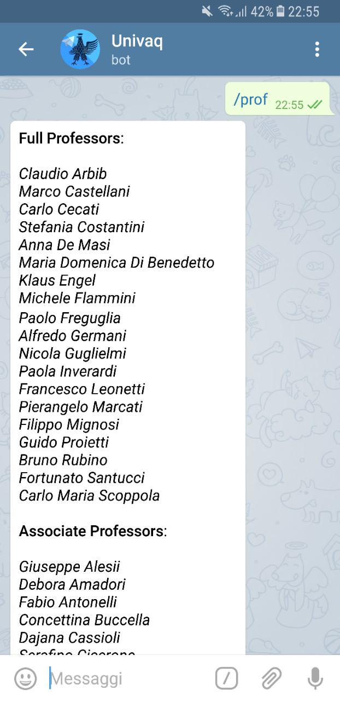
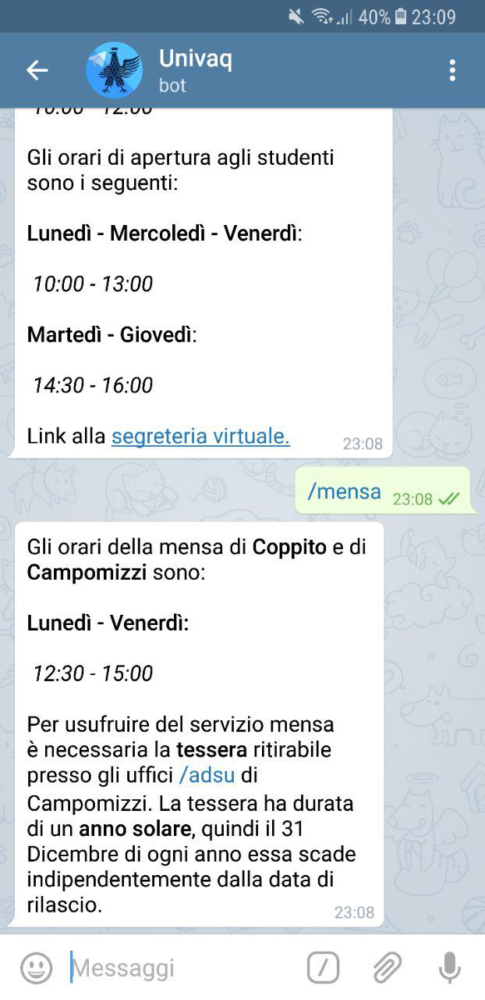
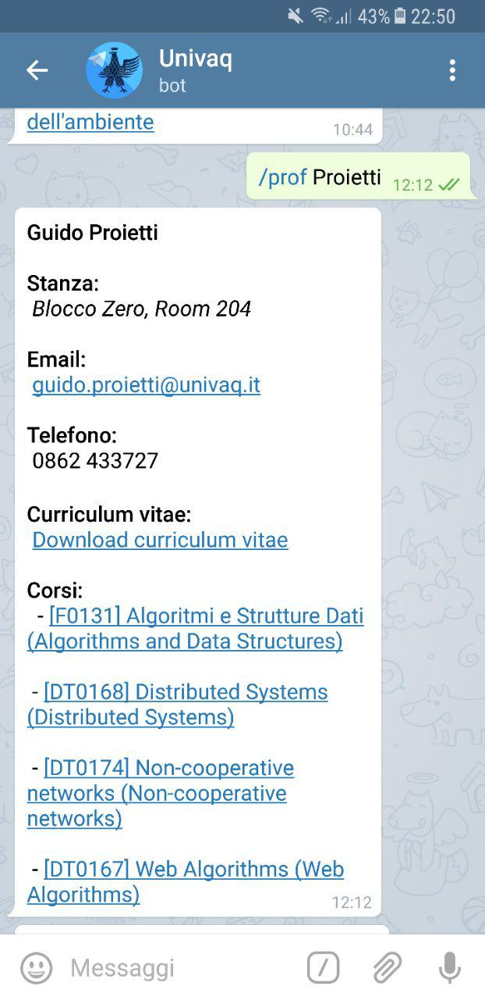
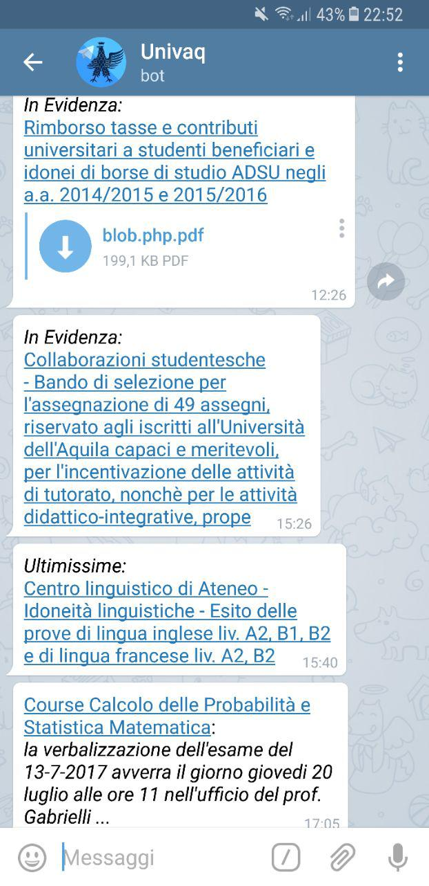

## UnivaqBot - Computer Science

This is an **Unofficial** [telegram bot](https://telegram.org/blog/bot-revolution) for the [University of L'Aquila](http://univaq.it).

This project was built to provide a simple way to retrieve informations about Univaq and its departments(for now just for [Disim](http://www.disim.univaq.it/main/index.php)).

All information is acquired, scraped, parsed, stored and synchronised using a bunch of Python scripts.

## Screenshots
 |  | 
--- | --- | ---
 |  | 

## Start using it

You can start using the univaq telegram bot by searching in the Telegram app for [@Univaq_Info_Bot](https://t.me/Univaq_Info_Bot).

## Functionalities

As with every telegram bot, you can ask the bot what does by entering `/help` or even `/start`.

```
La lista dei comandi:

help - Mostri la lista dei comandi.
disim - Mostra le ultime 5 news del Disim.
disimon - Abilita le notifiche per il Disim.
disimoff - Disattiva le notifiche per il Disim.
evidenza - Mostra le ultime 5 news della sezione 'Evidenza' (Univaq).
ultimissime - Mostra le ultime 5 news della sezione 'Ultimissime' (Univaq).
univaqon - Abilita le notifiche per l'Univaq.
univaqoff - Disattiva le notifiche per l'Univaq.
prof - Elenco dei professori del Disim.
segreteria - Info sulla segreteria.
mensa - Info sulla mensa.
adsu - Info sull'adsu.
feedback - Lascia un commento o un consiglio.
```

## Notifications

This bot also provides a **push notification service**.
When new unread news is published on the university website(and its departments), the univaq telegram bot can send it to you via a push notification (you can activate/deactivate this notification service in any time using the bot commands).

## DISCLAIMER

**THIS PROJECT IS NOT OFFICIALLY AFFILIATED WITH UNIVAQ INSTITUTION**

It's an open source project built for didactic purposes.
